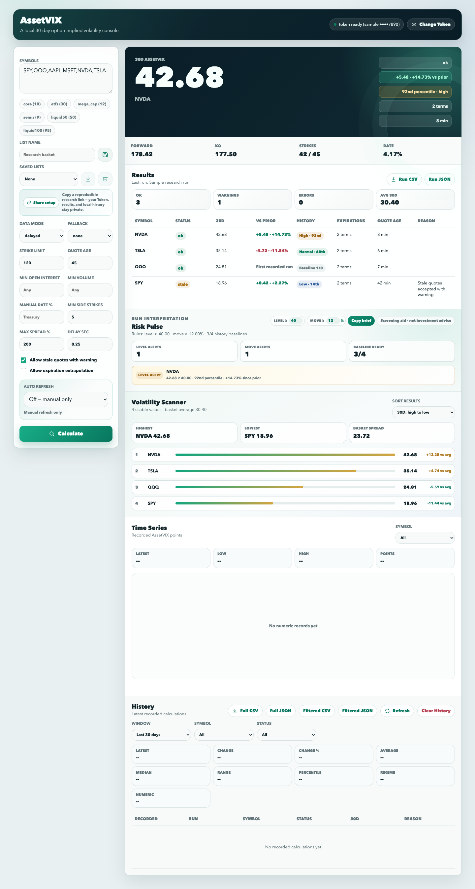

# AssetVIX

[](https://github.com/Kevin57890/VIX-calculation-for-other-assets/actions/workflows/ci.yml)
[](https://github.com/Kevin57890/VIX-calculation-for-other-assets/releases)
[](LICENSE)

AssetVIX is a local web application and command-line tool for calculating a
VIX-style 30-day option-implied volatility value for optionable US equities and
ETFs.

> AssetVIX is not the official Cboe VIX. The official VIX is a proprietary Cboe
> index based on specific SPX/SPXW option inputs and index-governance rules.

## What It Does

AssetVIX turns option-chain data into a practical local volatility-monitoring
workflow:

- estimates a VIX-style 30-day implied-volatility value for selected symbols
- runs locally in a browser or from the command line
- records every calculation to local CSV history
- charts historical AssetVIX values
- filters, summarizes, and exports calculation history
- keeps bad or stale inputs visible as diagnostics instead of hiding failures

The app uses MarketData.app option-chain data, US Treasury yield-curve data, and
the public SPX VIX calculation structure. It is designed for research,
monitoring, and prototyping rather than for publishing an official index.

## Usage Preview



The preview uses sample values to show the local workflow: choose or save a
symbol list, set quote-quality controls, share the non-sensitive research
setup, calculate VIX-style 30-day implied volatility, review the run summary,
export the current run, review per-symbol diagnostics, inspect filtered history
analytics, and export filtered recorded history. Actual calculations require
your own MarketData.app token and live, delayed, or cached option-chain access.

Quick start:

```bash
git clone https://github.com/Kevin57890/VIX-calculation-for-other-assets.git
cd VIX-calculation-for-other-assets
python3 run.py
```

For automation or scheduled checks:

```bash
python3 asset_vix.py --symbols SPY,QQQ --mode delayed --json --fail-on-non-ok
```

## Highlights

- Local browser UI and command-line batch mode
- User-provided MarketData.app API token with validation before saving
- No third-party Python runtime dependencies
- Preset symbol universes for liquid ETFs and large-cap equities
- 30-day variance interpolation
- Treasury yield-curve based risk-free-rate interpolation
- Bid/ask midpoint option pricing
- Wide-spread quote filtering
- Minimum option volume and open-interest filters in the web app
- Manual risk-free-rate override and minimum strike-depth control
- Stale quote diagnostics
- Per-symbol failure reasons instead of silently publishing bad values
- Automatic local CSV records for every calculation
- Browser time-series chart built from recorded AssetVIX points
- CSV and JSON history exports with an in-app clear action
- History filtering by symbol and result status
- Server-side history API filters for symbol and status
- Filtered history analytics for latest, change, average, range, and numeric
  sample counts
- Rolling 7-day, 30-day, 90-day, and 12-month history windows for focused
  monitoring and matching filtered exports
- History median, period-over-period percentage change, percentile rank, and
  low/normal/high volatility-regime context
- Optional 5/15/30/60-minute auto refresh for page-open monitoring, with a
  next-run countdown and automatic pause when the browser tab is hidden
- Cross-asset Volatility Scanner that ranks a calculation basket, highlights
  high/low values and spread, and shows every symbol versus its basket average
- Per-symbol comparison against the previous recorded run, including absolute
  and percentage AssetVIX change without altering the historical-record schema
- Per-symbol historical percentile and high/normal/low regime context, shown
  only after at least three prior usable local observations
- Risk Pulse panel that groups elevated-history readings and sharp run-to-run
  moves into a compact, clickable monitoring shortlist
- Browser-saved Risk Pulse level and percentage-move thresholds, with a
  one-click plain-text briefing for a research log or team update
- One-click shareable research-setup links for symbols, data mode, quality
  filters, and Risk Pulse rules; tokens, results, and local history are never
  included
- Current-run CSV and JSON exports from the results table
- Filtered history CSV and JSON exports from the selected history view
- Current-run summary for OK, warning, error, and average 30-day values
- Browser-saved custom symbol lists for recurring research baskets
- Automatic browser-side memory for non-sensitive query settings
- Thread-safe in-process calculation history writes
- Automated CI checks across supported Python versions

## Formula

This section intentionally uses plain text formulas instead of GitHub math
blocks. The README stays readable even when a Markdown viewer does not render
LaTeX.

The calculation follows the public VIX-style structure. For each selected
expiration term:

Notation:

- `T`: time to expiration in years
- `R`: continuously compounded risk-free rate
- `K`: option strike
- `C(K)`: call midpoint at strike `K`
- `P(K)`: put midpoint at strike `K`
- `F`: estimated forward level
- `K0`: highest selected strike at or below `F`
- `Q(K)`: option price used in the variance sum
- `DeltaK`: strike spacing around a selected strike

### Forward Level

1. Find the strike where call and put prices are closest:

```text
K* = strike where abs(C(K) - P(K)) is smallest
```

2. Estimate the forward level with put-call parity:

```text
F = K* + exp(R * T) * (C(K*) - P(K*))
```

3. Select `K0`:

```text
K0 = highest available strike where K <= F
```

### Option Price Selection

For each selected strike, AssetVIX uses:

```text
if K < K0:  Q(K) = put midpoint
if K = K0:  Q(K) = average of call midpoint and put midpoint
if K > K0:  Q(K) = call midpoint
```

In practical terms:

- OTM puts when `K < K0`
- the average of call and put midpoints when `K = K0`
- OTM calls when `K > K0`

### Strike Intervals

The interval around each selected strike is:

```text
first strike:   DeltaK = next strike - current strike
middle strike:  DeltaK = (next strike - previous strike) / 2
last strike:    DeltaK = current strike - previous strike
```

### Single-Term Variance

Each expiration term produces one annualized variance estimate:

```text
term_variance =
  (2 / T) * sum((DeltaK / K^2) * exp(R * T) * Q(K))
  - (1 / T) * (F / K0 - 1)^2
```

### 30-Day Interpolation

When two expirations bracket the target horizon, AssetVIX interpolates to 30
days. Let:

```text
N30  = minutes in 30 days
N365 = minutes in 365 days
N1   = minutes to the front expiration
N2   = minutes to the rear expiration
T1   = years to the front expiration
T2   = years to the rear expiration
```

Then:

```text
variance_30d =
  (
    T1 * variance1 * (N2 - N30) / (N2 - N1)
    + T2 * variance2 * (N30 - N1) / (N2 - N1)
  )
  * N365 / N30
```

If a selected expiration is effectively at the target horizon, the app uses
that term's variance directly.

The displayed AssetVIX value is:

```text
AssetVIX_30d = 100 * sqrt(variance_30d)
```

By default, the app uses the SPX VIX-style expiration window of 23 to 37 days
around the 30-day target.

## How It Works

For each symbol, AssetVIX:

1. Loads available option expirations from MarketData.app.
2. Selects expiration terms around the 30-day target horizon, defaulting to the
   23-37 day VIX-style window.
3. Loads option chains for the selected expirations.
4. Uses call/put parity to estimate the forward level.
5. Selects the strike at or below the forward level as `K0`.
6. Uses out-of-the-money puts and calls for variance contribution.
7. Applies quote-quality filters and zero-bid stopping logic.
8. Computes term variance.
9. Interpolates to a 30-day target horizon.
10. Returns `AssetVIX = sqrt(30-day variance) * 100`.

The output includes diagnostic fields such as selected expirations, forward
levels, `K0`, strike counts, quote age, and failure reasons.

## Project Status

AssetVIX is a local-first research tool. The repository is intended to be usable
from a fresh clone: it includes the local web app, CLI, preset symbol universes,
unit tests, contribution notes, security guidance, and a changelog.

Maintenance files:

- [Contributing guide](CONTRIBUTING.md)
- [Security policy](SECURITY.md)
- [Changelog](CHANGELOG.md)

## Requirements

- Python 3.9 or newer
- Internet access
- A MarketData.app API token with access to:
  - US stock quote endpoints
  - US option expiration and option-chain endpoints

No external Python packages are required. The project uses only the Python
standard library.

## Installation

Download or clone the repository:

```bash
git clone https://github.com/Kevin57890/VIX-calculation-for-other-assets.git
cd VIX-calculation-for-other-assets
```

Optional, but safe for deployment tools:

```bash
pip install -r requirements.txt
```

`requirements.txt` is intentionally empty because the app has no third-party
dependencies.

## Get a MarketData.app API Token

1. Sign in to [MarketData.app](https://www.marketdata.app/).
2. Open the account or customer dashboard.
3. Find the API token or request-token section.
4. Generate a token.
5. Keep the token private.

Only paste the token value into the app. Do not paste command snippets such as:

```text
Bearer ...
MARKETDATA_TOKEN=...
export MARKETDATA_TOKEN=...
```

The app tries to clean common paste formats, but using the raw token is safest.

## Run the Local Web App

From the repository directory:

```bash
python3 run.py
```

If your system uses `python` instead of `python3`:

```bash
python run.py
```

The terminal prints a local URL, usually:

```text
http://127.0.0.1:8765/
```

Open the URL in a browser. Click **Add Token**, paste your MarketData.app token,
and save it. The app validates the token against both a stock quote endpoint and
an option-expiration endpoint before saving it.

The token is stored locally in `.env`, which is ignored by Git.

Check the installed project version with:

```bash
python3 asset_vix.py --version
```

## Command-Line Usage

Single-symbol test:

```bash
python3 asset_vix.py --symbols SPY --mode delayed --allow-stale
```

Core liquid universe:

```bash
python3 asset_vix.py \
  --universe core \
  --mode delayed
```

Run every five minutes:

```bash
python3 asset_vix.py \
  --universe core \
  --mode delayed \
  --watch \
  --interval-seconds 300
```

Each command-line calculation is recorded by default. To write to a custom
record file:

```bash
python3 asset_vix.py --symbols SPY,QQQ --csv records/custom.csv
```

To run without recording:

```bash
python3 asset_vix.py --symbols SPY --no-record
```

For scripts and scheduled jobs, return exit status `1` when any symbol is not
`ok`:

```bash
python3 asset_vix.py \
  --symbols SPY,QQQ \
  --json \
  --fail-on-non-ok
```

You can also provide the token through the shell:

```bash
export MARKETDATA_TOKEN="your_marketdata_token_here"
```

## Automatic Records

The web app and command-line tool append every calculation to:

```text
records/calculations.csv
```

The file is created automatically on the first calculation. Each saved row
includes `recorded_at_utc`, `run_id`, and `source` fields in addition to the
calculation diagnostics.

In the web app, the **Time Series** chart connects recorded AssetVIX values by
record time. The chart can show all recorded symbols or one selected symbol. The
**History** table shows the latest recorded rows after every query. Use
**Download CSV** or **Download JSON** to export the full local record file. Use
the symbol and status controls to request filtered history from the local API.
Use **Filtered CSV** or **Filtered JSON** to export only the current filtered
history view. Use **Clear History** to remove the local record file after
confirmation. The history analytics strip summarizes the current filtered view
with latest value, change, average, range, and usable numeric sample count.

For one-off analysis, the **Results** table can export only the most recent
calculation run as CSV or JSON without downloading the full history file. The
same section summarizes OK, warning, error, and average 30-day values for the
latest run.

The `records/` directory is ignored by Git so downloaded copies of this project
do not publish local calculation history.

## Preset Universes

Preset symbols are stored in `universes.csv`.

Useful groups include:

- `core`
- `etfs`
- `mega_cap`
- `semis`
- `liquid50`
- `liquid100`

Edit `universes.csv` to add or remove symbols without changing application
code. A single browser query accepts up to 100 unique symbols to prevent
accidental long-running requests and unexpected API-credit usage.

## Web App Controls

- **Symbols**: comma-, space-, or newline-separated ticker symbols.
- **Saved lists**: browser-local custom symbol baskets for recurring research.
- **Data mode**: `delayed`, `cached`, or `live`, depending on the
  MarketData.app plan.
- **Fallback**: optional retry mode when cached data is unavailable.
- **Strike limit**: maximum number of strikes requested per expiration.
- **Min open interest**: optional server-side option-chain liquidity filter.
- **Min volume**: optional server-side option-chain activity filter.
- **Manual rate %**: optional annualized risk-free rate override; blank uses the
  Treasury curve.
- **Min side strikes**: minimum usable out-of-the-money puts and calls required
  for each term.
- **Quote age**: maximum accepted quote age before the row is marked stale.
- **Max spread %**: filters quotes with very wide bid/ask spreads.
- **Delay sec**: adds a small delay between symbols to reduce bursty API calls.
- **Allow stale quotes with warning**: keeps stale rows but marks them clearly.
- **Allow expiration extrapolation**: uses the nearest expirations when the
  available expirations do not bracket the 30-day target.
- **Time Series**: plots recorded numeric AssetVIX points over time from the
  local records file.
- **Results actions**: summarize and export the latest calculation run as CSV
  or JSON.
- **History actions**: refresh, export all records, export filtered records, or
  clear local records.
- **History Analytics**: summarizes the selected history view with latest,
  change, average, range, and numeric record coverage.

The browser remembers symbols, data mode, quality filters, and toggles locally
between sessions. API tokens are not stored in browser storage.

## Methodology Boundaries

The formula implementation follows the public SPX VIX mathematics. Exact
official VIX replication also depends on Cboe's official SPX/SPXW input data,
settlement conventions, filtering rules, dissemination rules, and index
governance. AssetVIX can produce a VIX-style value for arbitrary optionable
symbols, but those values are not official exchange indices.

## References

- [Cboe Volatility Index Methodology](https://cdn.cboe.com/resources/indices/Volatility_Index_Methodology_Cboe_Volatility_Index.pdf)
- [Cboe Volatility Index Mathematics Methodology](https://cdn.cboe.com/resources/indices/Cboe_Volatility_Index_Mathematics_Methodology.pdf)
- [MarketData.app API Documentation](https://www.marketdata.app/docs/api/)

## Output Fields

Common output fields include:

- `ts_utc`: calculation timestamp
- `symbol`: underlying symbol
- `status`: `ok`, `error`, or a warning status
- `asset_vix_30d`: 30-day VIX-like value
- `variance_30d`: interpolated 30-day variance
- `expirations`: selected expiration dates
- `days`: time to selected expirations
- `rates`: interpolated risk-free rates
- `forwards`: estimated forward levels
- `k0`: selected `K0` strikes
- `strike_counts`: number of strikes used in each term calculation
- `max_quote_age_minutes`: maximum quote age observed
- `reason`: diagnostic reason when the row is not valid

## Reliability Rules

Only treat `status = ok` as a fresh publishable value.

For any other status, store the row as a diagnostic. A downstream system should
keep the last valid value or mark the symbol unavailable instead of publishing a
new number.

Common non-publishable cases:

- invalid or insufficient MarketData.app plan
- stale quotes
- too few usable out-of-the-money calls or puts
- missing expiration terms
- wide or crossed bid/ask quotes
- temporary MarketData.app or network errors

## Data and Methodology Notes

AssetVIX depends on option-chain quality. Thin symbols, stale quotes, or wide
spreads can produce unstable values. The app is intentionally conservative: it
returns diagnostics instead of forcing a number when the input data is not good
enough.

For individual equities, early exercise, dividends, corporate actions, and
option adjustments may affect results. This app is a practical monitoring tool,
not an exchange-governed index engine.

## Security

Do not commit or distribute local runtime files:

- `.env`
- `results.csv`
- `records/`
- `__pycache__/`
- `.pytest_cache/`

These files are ignored by `.gitignore`.

If an API token is ever pasted into a public issue, chat, commit, or screenshot,
rotate it in the MarketData.app dashboard.

## Tests

Run the local unit tests:

```bash
python3 -m unittest test_asset_vix.py test_server_token.py
```

GitHub Actions runs the same suite plus source compilation on Python 3.9 and
3.13 for every push to `main` and every pull request.

## License

MIT License. See `LICENSE`.
